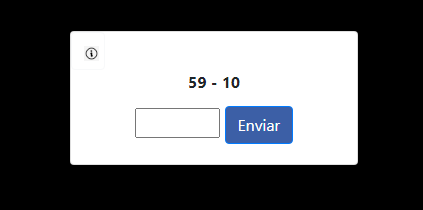

<h1 align="center">
  Calculator Game
</h1>

  

  Clique <a href="https://web-production-f1514.up.railway.app/" target="_blank">aqui</a> para acessar o site.

<h3 align="center">
  Sobre
</h3>

  Calculator é um jogo educacional para melhorar o seu raciocínio usando questões de matemática com os operadores fundamentais. Com o Calculator, você poderá treinar 
  suas habilidades em matemática e raciocínio, adquirindo um raciocínio mais rápido e eficaz.

<h3 align="center">
  Como funciona?
</h3>

  ▸ Você entrará no site e a partir disso, já poderá responder diversas questões de matemática. 
  ▸ As questões variam entre adição, subtração, multiplicação e divisão. 
  ▸ O jogo contém um algoritmo de pontuação de sequências de acertos. Quanto mais questões você acertar, mais sua pontuação aumentará.

<h3 align="center">
  Tecnologias usadas
</h3>

  
  
  
  

